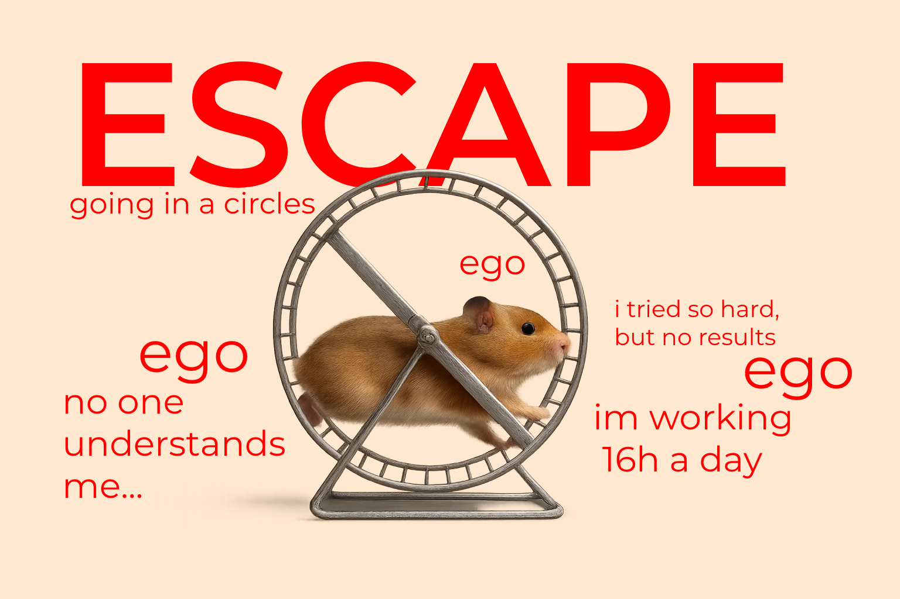

  

# Transformation Framework: Break Stagnation, Level Up with Clarity

This system is a step-by-step, first-principles-based transformation framework designed to break cycles of stagnation in life, business, and personal performance.

Built to identify the root causes of stuckness, uncover limiting behaviors and beliefs, and create clear action maps, this framework is especially suited for:

    Entrepreneurs and high-performers hitting plateaus

    Individuals in repetitive emotional or behavioral loops

    Coaches or mentors needing a structured transformation tool

# ✳️ Core Concept

    "Change doesn't come from trying harder. It comes from seeing clearer."

The goal is not motivation, but diagnosis and clarity—to act only once the real problem is named, and the right action is identified.

# 🔧 Architecture Overview

This system is structured into four recursive phases:

# look for outputs here --> outputs.md

# 🧩 Key Components

    Fact Inventory (Step 1): Diagnoses where energy is wasted or misdirected

    Distortion Detection (Step 2): Names hidden fear, broken logic, abdicated responsibility

    Passage Point (Step 3): Extracts a previously blocked, high-leverage experience

    Movement Plan (Step 4): Sets a clean, specific, resistance-aware plan into motion

# 🧠 Data Output & Tracking

All answers from the Fact Inventory phase are stored in a structured .csv file, allowing:

    Pattern recognition over time

    Behavioral trend analysis

    Integration into dashboards or journaling systems

# if youre interested in details feel free to DM me on telegram --- 

